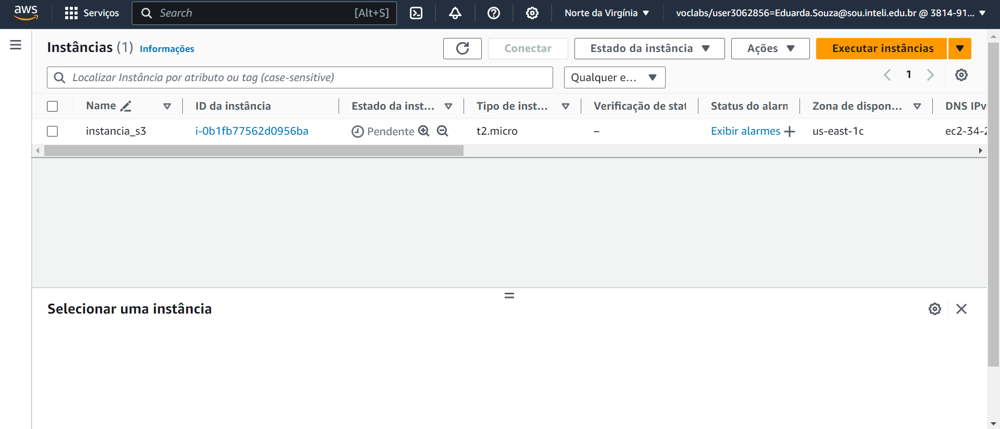
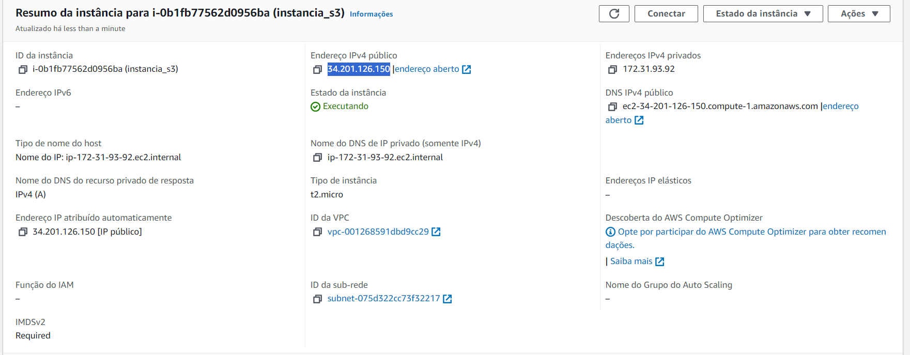
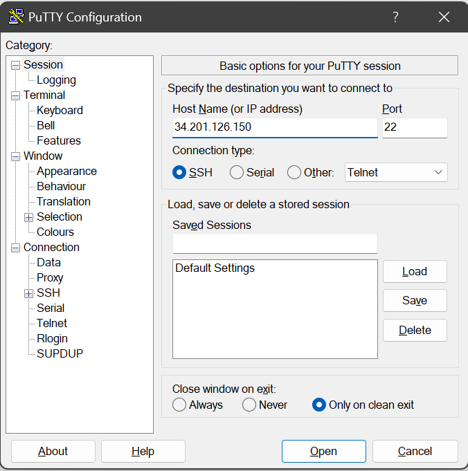
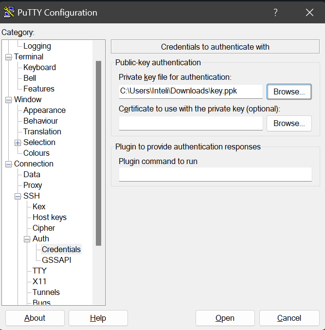
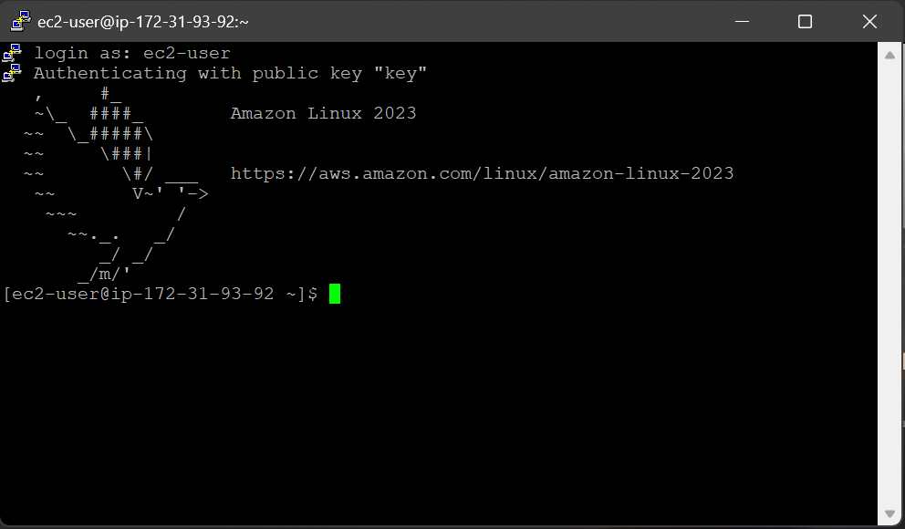

# Relatório Técnico - Implantação e Acesso a uma Instância EC2 na AWS via SSH

## Introdução
&emsp;O Amazon Elastic Compute Cloud (EC2) é um serviço de computação em nuvem da Amazon Web Services (AWS) que oferece capacidade de computação escalável na nuvem. Com o EC2, é possível provisionar e iniciar instâncias de servidores virtuais conforme necessário.

&emsp;Para acessar uma instância EC2 de forma remota e segura, utiliza-se o protocolo SSH (Secure Shell), que permite a comunicação criptografada entre o cliente (como o PuTTY) e o servidor EC2. A atividade proposta envolve a criação de uma instância EC2 na AWS e o acesso a ela utilizando o SSH, demonstrando assim o uso prático desses conceitos.

&emsp;Esse relatório apresenta a criação de uma instância EC2 na AWS e o acesso a ela utilizando o protocolo Secure Shell(SSH).
Será demonstrado a criação uma instância EC2 na AWS Academy, a configuração de uma chave de acesso, e finalmente, a conexão SSH bem-sucedida através do PuTTY.

## Objetivo
&emsp;O objetivo deste relatório técnico é documentar o processo de criação de uma instância de máquina EC2 na AWS e o acesso a essa instância utilizando o protocolo SSH, conforme solicitado na atividade de autoestudo. 

## Materiais
- Conta AWS Academy;
- Acesso ao GitHub;
- Cliente SSH(PuTTY).

## Método
&emsp;Primeiramente, eu loguei na plataforma da AWS Academy, iniciei um laboratório e criei a minha instância, gerando uma chave privada .ppk
 A seguir a instância criada:

&emsp;Após criar a instância, acessei o resumo da instância a fim de conseguir copiar o endereço IPv4 Público que será usado do cliente SSH(PuTTY).

&emsp;Acessando o PuTTY, adicionei o endereço IPv4 Público da minha instância no input "Host Name(or IP adress)".

&emsp;Em seguida acessei o seguinte caminho dentro do PuTTY: "Connection" -> "SSH" -> "Auth" e adicionei a minha chave privada gerada na criação da instância.

&emsp;Por fim, a conexão com a instância foi um sucesso.

## Resultados
&emsp;O relatório apresenta a forma como conectei a minha instância no Cliente SSH(PuTTY) de maneira clara e objetiva, fazendo o uso de uma linguagem de fácil entendimento e imagens para demonstrar a execução dos passos. Os resultados demonstram que a criação da instância EC2 na AWS e o acesso utilizando o protocolo SSH foi um sucesso.

## Conclusão
&emsp;Através deste relatório técnico, foi possível documentar de forma clara e detalhada o processo de criação de uma instância de máquina EC2 na AWS e o acesso a essa instância utilizando o protocolo SSH. Foi possível provisionar com sucesso uma instância EC2 na AWS, configurar as permissões de acesso SSH e conectar-se à instância utilizando o PuTTY, demonstrando assim a conclusão do objetivo proposto.
